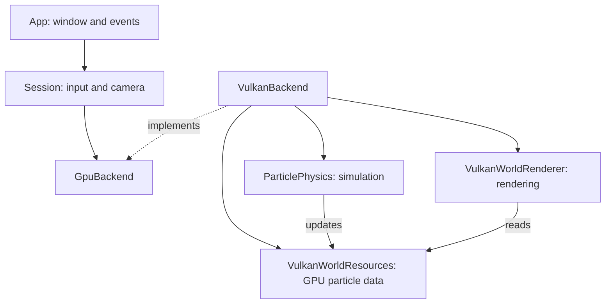

# GPU Fluid Simulation

A highly optimized, particle-based GPU fluid simulation written in Rust and Vulkan, featuring an octree-accelerated neighbor search and Slang compute/mesh shaders.

---

### Demo

<!-- Replace YOUR_VIDEO_ID with your actual YouTube video ID -->
[](https://www.youtube.com/watch?v=SBmlQNDkMKA)

> 💡 *Click the image above to watch the simulation in action on YouTube.*

---

## Features

- **Massive Particle Counts:** Simulates over 1,000,000 particles in real-time.
- **Octree Neighbor Search:** Fast GPU-based dynamic spatial partitioning.
- **Slang Shader Pipeline:** Shaders are compiled and embedded directly during the build.

---

## Code Organization



---

## Prerequisites

Ensure you have the following installed and supported on your system:

### Software
- **Rust Toolchain:** Latest stable Rust (`rustup default stable`).
- **[LLVM](https://github.com/llvm/llvm-project/releases)**
- **[LunarG Vulkan SDK](https://vulkan.lunarg.com/)**

### Hardware Requirements
- A modern GPU supporting **Vulkan 1.3+**.
- Support for **Mesh Shaders** (`VK_EXT_mesh_shader`).
- Support for **Subgroup / Wave operations** (subgroup arithmetic and extended types).

---

## Getting Started

Slang shaders are compiled automatically during the Cargo build and embedded into the final executable. Slang is automatically fetched if not detected locally.

### Run

Run the simulation with the default configuration (1,000,000 particles, `colliding-blocks` preset):

```bash
cargo run --release
```

> **Note:** The simulation launches in a **paused** state. Press <kbd>Space</kbd> to start or pause.

### Command-line Options

You can configure particle count and initial presets via CLI flags:

```bash
cargo run --release -- --num-particles 250000 --preset double-dam-break
```

Display all available flags and options:

```bash
cargo run --release -- --help
```

**Available Presets:**
- `colliding-blocks` (Default)
- `double-dam-break`
- `rotating-block`

---

## Controls

| Input | Action |
| :--- | :--- |
| <kbd>Space</kbd> | Start / Pause simulation |
| <kbd>Left Click + Drag</kbd> | Rotate camera |
| <kbd>Right Click + Drag</kbd> | Pan / Move camera |
| <kbd>Mouse Wheel</kbd> | Zoom in / out |

---

## Performance

| Metric | Result |
| :--- | :--- |
| **Particle Count** | 1,000,000 particles |
| **Frame Rate** | **~180 FPS** |

**Benchmark System Specs:**
- **GPU:** AMD Radeon RX 6800 XT
- **CPU:** AMD Ryzen 5 7600
- **OS:** Linux

---

## Testing & Benchmarks

Run unit and integration tests:

```bash
cargo test
```

Run simulation benchmarks:

```bash
cargo bench
```

---

## References

- [Divergence-free SPH (DFSPH)](https://dl.acm.org/doi/epdf/10.1145/2786784.2786796) — Jan Bender, Dan Koschier
- [Cornerstone: Octree Construction Algorithms for Scalable Particle Simulations](https://arxiv.org/abs/2307.06345) — J. Keller et al.
- [Single-pass Parallel Prefix Scan with Decoupled Look-back](https://research.nvidia.com/sites/default/files/pubs/2016-03_Single-pass-Parallel-Prefix/nvr-2016-002.pdf) — Duane Merrill, Michael Garland